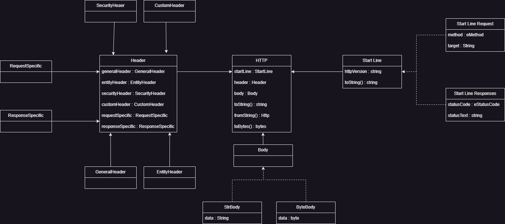

# HttpBuilder

A simple Http message builder, to be used into my Http Server.

- Create request and responses
- From the Http object create a byte array
- From the byte array transform it to a String

## Http Schema

## Installation

## Usage